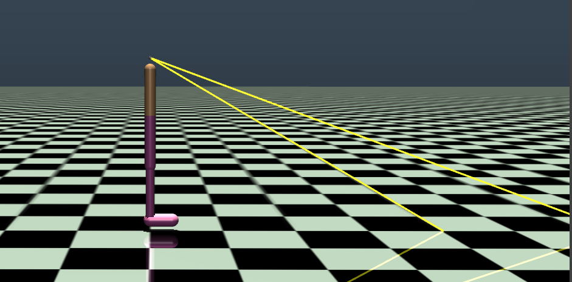

# Learn-to-move
Reinforcement learning envs for locomotion systems. like walking, hopping and humanoid walking

Written in python using stable-baselines3 and gym.

## Install and setup
Installing the depdencies
```bash
pip install -r requirements.txt
```

# 2D walker with eyes.
https://user-images.githubusercontent.com/34353557/176432825-8555df0a-0498-4613-9177-eaf5b22ec798.mp4


In this project as show in the image below, we will use a 2D walker with eyes. IT has two rangefinder sensor. which measures the distance to the nearest obstacle / ground. 



## Training algorithm (PPO)
I am using policy gradient algorithms to train the agent. specifically, I am using the PPO algorithm.

- If you want to learn more about the algorithm, please refer to the [paper](https://arxiv.org/abs/1707.06347).
- If you want to learn more about the policy gradient [here](https://youtu.be/y3oqOjHilio) is the tutorial which can get to you started. 

## Training details.
I am using the [stable-baselines3](https://github.com/DLR-RM/stable-baselines3) library to train the agent. I have pruned and updated the hyperparameters using [baselines3-rl-zoo](https://github.com/DLR-RM/rl-baselines3-zoo) and optuna to make the agent more stable. The hyperparameters and results are shown in the csv files [here](docs/images/walker/hyperparms).


Before you can train you need to update the walker.xml file in the gym/envs/mujoco/assets folder with this [file](gym_envs/walker_openai/mujoco_models/walker2d.xml).


To train the agent, run the following code.

```bash
python Models/walker2d/Train-vev.py
```

The output video will be recored by wandb, here is the link to my successful training.

[](https://wandb.ai/continuous-optimization/hopper-env/reports/--VmlldzoyMjQzNzQ2?accessToken=erph06s1g4xxx71wh2cbyst8bnf13h9qts3revmayqsjfct5t5qv1s5tpbm7htcr)


# Blind Hopper with disturbance

In this env the hopper has not information about the surroundings. It's only objective is to **move forward with high velocity**.


## Training

I have made training in multiple env together using [PPO policy](https://stable-baselines3.readthedocs.io/en/master/modules/ppo.html)

```bash
python Models/hopper/hopper_train_large_models.py
```


## Test
```bash
python Models/hopper/hopper_test.py
```

## Performing video.

### Hard_evn
https://user-images.githubusercontent.com/34353557/169736742-fd08db6a-a5ab-447f-abd6-2347b9571295.mp4

### wall jump

https://user-images.githubusercontent.com/34353557/169736884-68638296-e370-4149-abb9-e588e0f878ba.mp4

### small-no dist

https://user-images.githubusercontent.com/34353557/169737065-396608b3-f7c3-4611-8e5d-c24e25790e56.mp4


## Important rendering
Important information regarding rendering the model. 


## Notes on the dm control parkour.

The PPO is not working on the dm control parkour env.
As shown int he video above.

Possible reasons:
- The Env is not able to stand up.
- The Env is too hard for the current hopper. Need more actions.
So I am moving on to the hopper openai env. 
 
 
If you are trying to render the image, please use the following command.

```bash
set -Ux LD_PRELOAD /usr/lib/x86_64-linux-gnu/libGLEW.so
```


Do not forget to delete the LD_PRELOAD variable.
```bash
unset LD_PRELOAD
```
